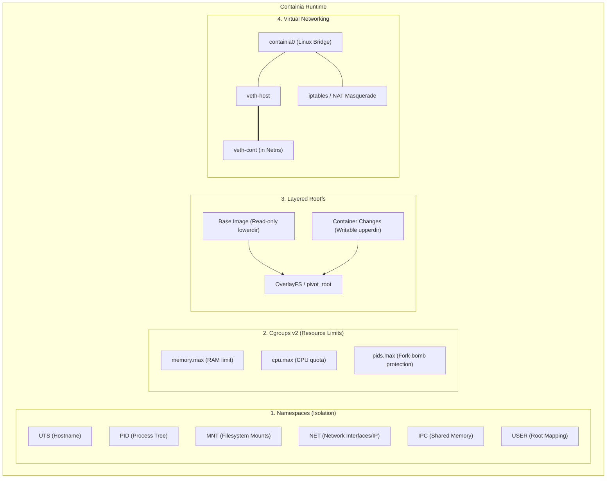

# GEMINI.md - Containia Project & Architecture Documentation

## 1. Project Overview & Vision

**Containia** คือโปรเจกต์ Mini Container Runtime สร้างขึ้นเพื่อการเรียนรู้เชิงลึกด้านระบบปฏิบัติการ (Operating Systems) และ Computer Science โดยมีเป้าหมายในการจำลองการทำงานพื้นฐานของ Docker / OCI Runc จากศูนย์ (From Scratch)

> **Core Philosophy:** "A container is not a VM; it's just an isolated Linux process with resource boundaries."

---

## 2. Core Concepts: สิ่งที่ต้องรู้เกี่ยวกับ Container

Container บน Linux ถูกสร้างขึ้นจากฟีเจอร์หลักของ Linux Kernel 5 ส่วน:



### 2.1 Linux Namespaces (การแยกมุมมองของ Process)
Namespaces ทำให้ process มองเห็นเฉพาะทรัพยากรที่เป็นของตนเอง:
- **`CLONE_NEWUTS` (UTS):** แยก Hostname และ Domain Name (เช่น ตั้งชื่อ container เป็น `my-container`)
- **`CLONE_NEWPID` (PID):** แยก Process ID Tree ทำให้ process หลักใน container กลายเป็น `PID 1`
- **`CLONE_NEWNS` (Mount):** แยก Mount table ทำให้ mount/unmount ใน container ไม่กระทบเครื่อง Host
- **`CLONE_NEWNET` (Network):** แยก Network interfaces, IP routing tables, iptables rules, ports
- **`CLONE_NEWIPC` (IPC):** แยก Inter-Process Communication (Shared memory, Semaphores, Message queues)
- **`CLONE_NEWUSER` (User):** Map UID/GID ภายนอก (Unprivileged user) ให้เป็น UID 0 (root) ภายใน container

### 2.2 Control Groups (cgroups v2) (การจำกัดและติดตามทรัพยากร)
Linux Cgroups (ปัจจุบันใช้ cgroups v2 ซึ่งเป็น Unified hierarchy ภายใต้ `/sys/fs/cgroup/`) ทำหน้าที่:
- **Memory:** ควบคุมผ่าน `/sys/fs/cgroup/containia/<cid>/memory.max` (เช่น `256M`)
- **CPU:** ควบคุมผ่าน `cpu.max` (เช่น `50000 100000` = ให้ใช้งานได้ 50% ของ 1 Core)
- **PID Limit:** ควบคุมผ่าน `pids.max` (ป้องกัน fork-bomb โจมตีระบบ Host)

### 2.3 Filesystem Isolation & Layering
- **`chroot` vs `pivot_root`:**
  - `chroot` เปลี่ยนเฉพาะ root directory ปัจจุบัน แต่ escape ออกได้ง่าย
  - `pivot_root` ย้าย mount tree เดิมไปซ่อน และเปลี่ยน root filesystem ของ mount namespace อย่างสมบูรณ์ (Docker ใช้ `pivot_root`)
- **OverlayFS (Union Mount):**
  - **`lowerdir`:** Rootfs ของ base image (Read-only เช่น Alpine Linux minirootfs)
  - **`upperdir`:** Layer ที่ container เขียนทับ (Writable)
  - **`workdir`:** Working directory ชั่วคราวสำหรับ OverlayFS
  - **`merged`:** Directory รวมที่ container มองเห็นจริง

### 2.4 Virtual Networking (Container Connectivity)
1. สร้าง **Linux Bridge** บน Host (เช่น `containia0` ที่มี IP `172.18.0.1/24`)
2. สร้าง **veth pair** (virtual ethernet cable: ด้านหนึ่งอยู่บน Host เชื่อมกับ Bridge อีกด้านถูกย้ายเข้าไปใน Network Namespace ของ container)
3. กำหนด IP ให้ container (เช่น `172.18.0.2/24`) และตั้งค่า Default Gateway ชี้ไปที่ `172.18.0.1`
4. เปิด **IP Forwarding** บน Host (`sysctl net.ipv4.ip_forward=1`) และเพิ่ม **iptables NAT MASQUERADE** เพื่อให้ container ออกสู่อินเทอร์เน็ตภายนอกได้

---

## 3. Technology Stack & Prerequisites

### แนะนำ: ภาษา **Go (Golang)**
- **เหตุผล:**
  - Docker, containerd, Kubernetes, และ runc เขียนด้วย Go 100%
  - Standard library มี package `syscall`, `os/exec`, และ ecosystem เช่น `golang.org/x/sys/unix` ที่รองรับ Linux syscalls โดยตรง
  - Compile เป็น static single binary ง่าย ไม่ต้องพึ่งพา runtime ขนาดใหญ่

### สภาพแวดล้อมที่จำเป็น (Development Environment)
> **สำคัญมาก:** Linux Namespaces และ Cgroups เป็นฟีเจอร์ระดับ Linux Kernel ดังนั้นบน Windows ต้องรันและพัฒนาผ่าน **WSL2 (Ubuntu 22.04 / 24.04)** หรือ **Linux VM** เท่านั้น

---

## 4. Architecture Design & "Re-exec" Pattern

ปัญหาคลาสสิกของ Go ในการสร้าง Namespace:
> ภาษา Go เป็น Multi-threaded Runtime (Goroutines) แต่ System Call อย่าง `setns` หรือการ unshare บางอย่างจำเป็นต้องทำก่อนที่ Process จะ spawn threads หลายตัว

วิธีแก้ที่ Docker และ runc ใช้คือ **Self-Re-exec Pattern**:

```
[containia run <image> <command>]
        │
        ▼ (Host Process)
  1. สร้าง cgroup directory (/sys/fs/cgroup/containia/<cid>)
  2. เตรียม OverlayFS mount (merged directory)
  3. Fork process ตัวเองด้วย Flag Clone:
     cmd := exec.Command("/proc/self/exe", "child", <cid>, <command>)
     cmd.SysProcAttr = &syscall.SysProcAttr{
         Cloneflags: syscall.CLONE_NEWUTS | 
                     syscall.CLONE_NEWPID | 
                     syscall.CLONE_NEWNS  | 
                     syscall.CLONE_NEWNET | 
                     syscall.CLONE_NEWIPC,
     }
        │
        ▼ (Child Process ภายใน Isolated Namespaces)
  4. ตั้งค่า Hostname (sethostname)
  5. Mount private proc (`mount -t proc proc /proc`)
  6. pivot_root สลับ root directory ไปที่ merged rootfs
  7. syscall.Exec เรียกคำสั่งของผู้ใช้ (เช่น /bin/sh) แทนที่ child process
```

---

## 5. Implementation Roadmap (แบ่งเป็น Phase)

| Phase | Milestone | คำอธิบาย |
| :--- | :--- | :--- |
| **Phase 1** | **Basic Isolation** | ใช้ UTS + PID Namespace + `pivot_root` รัน Shell บน Alpine rootfs แบบ isolated |
| **Phase 2** | **OverlayFS Layering** | แยก Base Image (Read-only) กับ Container Layer (Writable) ด้วย OverlayFS |
| **Phase 3** | **Cgroups v2 Resource Control** | จำกัด RAM (`memory.max`) และ Process (`pids.max`) |
| **Phase 4** | **Container Networking** | สร้าง Bridge, veth-pair, กำหนด IP, ทำ NAT ให้ออกเน็ตได้ |
| **Phase 5** | **CLI & Image Management** | คำสั่ง `containia run`, `containia ps`, ดาวน์โหลด Alpine rootfs tarball อัตโนมัติ |

---

## 6. Directory Structure (Proposed Layout)

```
containia/
├── GEMINI.md                 # Agent Persistent Memory & Blueprint
├── README.md                 # General info & Quickstart
├── go.mod                    # Go module definition
├── cmd/
│   └── containia/
│       └── main.go           # CLI Entrypoint (run, ps, images, pull, stop, rm, logs, exec)
├── pkg/
│   ├── builder/              # Dockerfile parser & layer builder (containia build)
│   │   └── builder.go
│   ├── config/               # Types, states, and runtime directory layout
│   │   ├── types.go
│   │   └── paths.go
│   ├── dashboard/            # Embedded Web Monitor GUI & REST API
│   │   ├── dashboard.go
│   │   └── assets/           # HTML5, modern CSS, reactive JS
│   ├── image/                # OCI Registry v2 client, layer caching, image manager
│   │   ├── image.go
│   │   └── registry.go
│   ├── cgroup/               # Cgroups v2 manager (memory.max, cpu.max, pids.max)
│   │   └── cgroup.go
│   ├── rootfs/               # Multi-layer OverlayFS & pivot_root isolation
│   │   └── rootfs.go
│   ├── network/              # Linux Bridge (containia0), veth pair, netns
│   │   └── network.go
│   └── runtime/              # Container lifecycle orchestrator & self-re-exec
│       └── runtime.go
└── containia                 # Compiled Linux ELF binary (Go 1.26 / x86_64)
```

---

## 7. Current State & Verification Status

All core container subsystems have been fully implemented and verified under Linux Kernel (WSL2):

- [x] **Go Module & Dependencies:** Configured with `golang.org/x/sys`.
- [x] **Phase 1: Basic Isolation:** Implemented UTS + PID + Mount + IPC + NET Namespaces with `pivot_root`. Verified PID 1 isolation inside container.
- [x] **Phase 2: OverlayFS Layering:** Base image (`lowerdir`) is read-only; container changes write to ephemeral `upperdir`. Verified cross-container filesystem immutability.
- [x] **Phase 3: Cgroups v2 Resource Control:** Successfully enforced `memory.max` (verified 64MB limit in `/sys/fs/cgroup/containia/<id>/memory.max`), `cpu.max`, and `pids.max`.
- [x] **Phase 4: Container Networking:** Virtual ethernet pairs connected to `containia0` bridge with deterministic IP assignment and iptables NAT Masquerade.
- [x] **Phase 5: Docker-compatible CLI & Image Manager:**
  - `containia pull alpine`: Downloads and extracts Alpine rootfs from official CDN.
  - `containia run`: Supports `-i`, `-t`, `-d`, `--rm`, `-m`, `--cpus`, `--pids-limit`, `-v`, `-e`, `--name`.
  - `containia ps [-a]`: Lists active and stopped containers.
  - `containia logs <cid>`: Streams detached stdout/stderr.
  - `containia exec <cid> <cmd>`: Attaches to running container namespaces via `nsenter`.
  - `containia stop <cid>`: Graceful SIGTERM followed by SIGKILL.
  - `containia rm [-f] <cid>`: Safe unmount of OverlayFS and cleanup of metadata.
- [x] **Phase 6: OCI Image System & Dockerfile Builder (Podman parity):**
  - **Docker Registry v2 Client:** Token authentication (`auth.docker.io`), multi-arch manifest resolution (`linux/amd64`), automated 401 retry token refresh.
  - **Multi-layer OverlayFS:** Layers cached in `/var/lib/containia/layers/<digest>/fs` and mounted stacked via `lowerdir=l_top:...:l_bottom`.
  - **Dockerfile Builder (`containia build`):** Parses `FROM`, `ENV`, `WORKDIR`, `EXPOSE`, `CMD`, `ENTRYPOINT`, `COPY`, creates stacked layers, and writes content-addressable metadata.
  - **Image GC & Lifecycle:** `containia rmi <image>` removes images and cleans orphaned layers.
  - **Runtime Auto-Config:** Container entrypoint, cmd, env, and workingdir are automatically inherited from image metadata.
- [x] **Phase 7: Web Monitor GUI Dashboard (`containia ui`):**
  - **Embedded Web Server:** Single binary embeds HTML5, modern Vanilla CSS, and reactive JS via `go:embed`.
  - **Real-time Monitoring:** Cgroups v2 live memory/CPU stats, process counts, container statuses, and virtual bridge routing.
  - **Management Console:** Stop/Remove containers, live log streaming, image puller, layer visualizer, and Dockerfile builder GUI.

