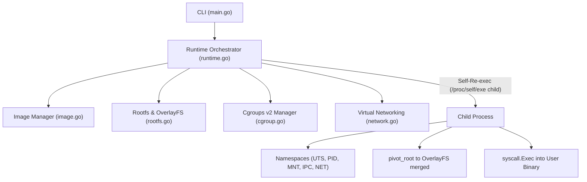

# Containia 📦

> A Mini Docker-compatible Container Runtime built from scratch in Go for Computer Science & Operating Systems education.

[](https://golang.org)
[](https://kernel.org)
[](https://man7.org/linux/man-pages/man7/namespaces.7.html)

---

## 🎯 Features

- **Linux Namespaces Isolation:**
  - `CLONE_NEWUTS`: Isolated hostname
  - `CLONE_NEWPID`: Isolated PID tree (container entrypoint is PID 1)
  - `CLONE_NEWNS`: Private mount table & `pivot_root`
  - `CLONE_NEWIPC`: Isolated shared memory & IPC queues
  - `CLONE_NEWNET`: Virtual network namespace
- **OCI Registry v2 Client (Docker Hub & Multi-arch):**
  - Pull official images directly from Docker Hub (`postgres:18`, `alpine`, etc.)
  - Multi-architecture manifest resolution (`linux/amd64`)
  - Automated Bearer token authentication and refresh
- **Layered Storage (Multi-layer OverlayFS):**
  - Content-addressable layer cache in `/var/lib/containia/layers/` (prevents duplicate layer downloads)
  - Stacked multi-layer OverlayFS mounts (`lowerdir=l_top:...:l_bottom`)
  - Ephemeral writable container layer (`upperdir`)
- **Dockerfile Builder (`containia build`):**
  - Build images from `Dockerfile` (`FROM`, `ENV`, `WORKDIR`, `EXPOSE`, `CMD`, `ENTRYPOINT`, `COPY`)
- **Resource Limits (Cgroups v2):**
  - Memory limit (`-m / --memory`) via `/sys/fs/cgroup/containia/<id>/memory.max`
  - CPU quota (`--cpus`) via `cpu.max`
  - Fork-bomb protection (`--pids-limit`) via `pids.max`
- **Volume Mounts & Environment:**
  - Bind mount host paths with `-v host_path:container_path`
  - Environment variables `-e KEY=VALUE` + auto-inherited image metadata ENV
- **Container Lifecycle Management (Docker/Podman CLI compatible):**
  - `containia pull <image>`
  - `containia build -t <tag> [context]`
  - `containia images`
  - `containia rmi <image>`
  - `containia run [OPTIONS] <image> [command]`
  - `containia ps [-a]`
  - `containia logs <container>`
  - `containia exec <container> <command>`
  - `containia stop <container>`
  - `containia rm [-f] <container>`

---

## 🛠️ Build & Installation

### Prerequisites
- Go 1.24+ (Windows or Linux)
- Linux Kernel 5.x+ or **WSL2** (Namespaces & Cgroups v2 support)

### Compile
```powershell
# From Windows PowerShell cross-compiling for Linux
$env:GOOS="linux"; $env:GOARCH="amd64"; go build -o containia ./cmd/containia
```

Or inside Linux / WSL2:
```bash
go build -o containia ./cmd/containia
```

---

## 🚀 Usage Examples

### 1. Pull Base Image
```bash
sudo ./containia pull alpine
```

### 2. List Local Images
```bash
sudo ./containia images
```

### 3. Run an Interactive Shell
```bash
sudo ./containia run -it alpine /bin/sh
```
Inside the container:
```sh
/ # ps aux
PID   USER     TIME  COMMAND
    1 root      0:00 /bin/sh
/ # hostname
440215b35b2d
```

### 4. Run Detached with Resource Limits
```bash
sudo ./containia run -d --name my-app -m 128m --cpus 0.5 alpine sleep 3600
```

### 5. Check Running Containers
```bash
sudo ./containia ps
```

### 6. Exec into a Running Container
```bash
sudo ./containia exec my-app ps aux
```

### 7. Volume Mounting & Environment Variables
```bash
sudo ./containia run --rm \
  -e "APP_ENV=production" \
  -v "/mnt/host/d/dev/containia:/workspace" \
  alpine ls -la /workspace
```

### 8. View Logs
```bash
sudo ./containia logs my-app
```

### 9. Stop and Remove Container
```bash
sudo ./containia stop my-app
sudo ./containia rm my-app
```

### 10. Launch Web Monitor GUI Dashboard
```bash
sudo ./containia ui -p 8080
```
Open **http://localhost:8080** in your browser to monitor real-time containers, live cgroup memory/CPU usage, inspect OverlayFS layers, and manage OCI images!

---

## 🏗️ Architecture



See [GEMINI.md](file:///d:/dev/containia/GEMINI.md) for full architectural documentation.
